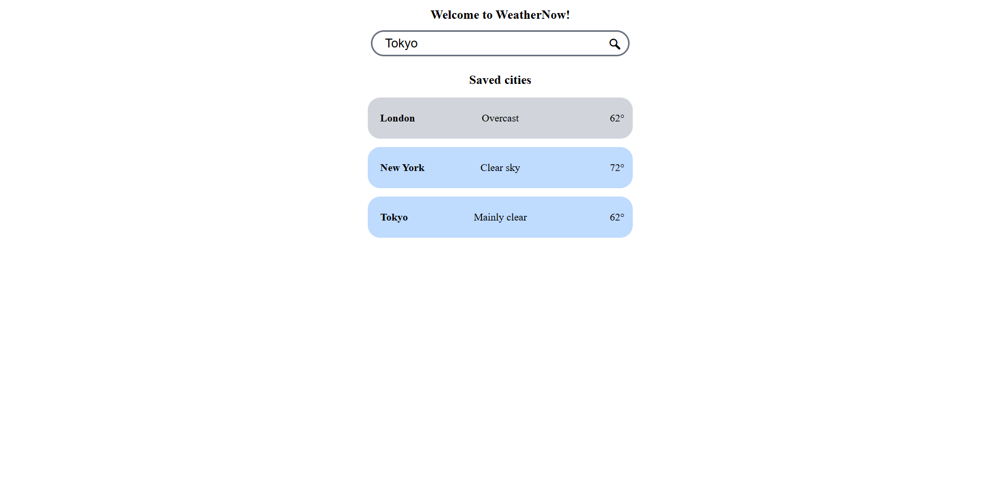
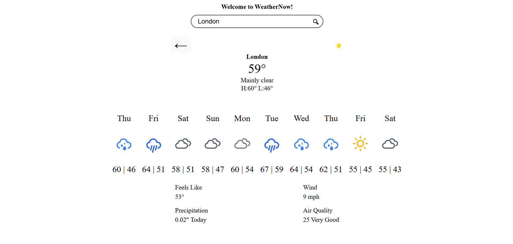

## WeatherNow

A weather dashboard built with Vanilla JavaScript. Searches any city, display the current condition, a 10-day forecast, and saves the city for quick access on the main page.

**[Live Demo](https://patrickphung3510.github.io/VanillaJS-weather-app/)**

## Features
- Search city worldwide by name
- Displays city name, current temperature, condition, and daily high/low
- 10-day forecast with conditions icons
- Current feels-like, wind, precipitation, and air quality with a rating from the city
- Save and remove favorite cities from with the star toggle, persisted through localStorage
- Dashboard card and icons colored by weather condition
- Responsive layout from phone to desktop
- Error message for cities that can't be found

## Built with
- HTML, CSS, JavaScript
- [Open-Meteo] (https://open-meteo.com/) Forecast, Geocoding, and Air Quality APIs
- [Weather Icons] (https://erikflowers.github.io/weather-icons/) via the Iconfiy API

## What I learned
- **Chaining async calls** a search runs a geocoding support request, then a weather request, and so on. I used async/await with a try/catch so any failure would show that a "city is not found" message.

- **Parallel arrays from the APIs.** daily forecast data were in separate arrays (dates, temperature, weather code) that was lined up by index. Thus, I used .map() with the index to build each forecast day.

- **Finding current hour** "feels like" data was an hourly array converting 10 days, so I used .slice() and .findIndex() to match the current hour instead of defaulting to midnight.

- **Dynamic UI** saved cities were stored as JSON in localStorage and rendering into cards, with a click listener that goes back to the detailed view each time the list re-renders.

## Credits
Weather data provided by [Open-Meteo](https://open-meteo.com/). Icons from [Weather Icons](https://erikflowers.github.io/weather-icons/) by Erik Flowers.

